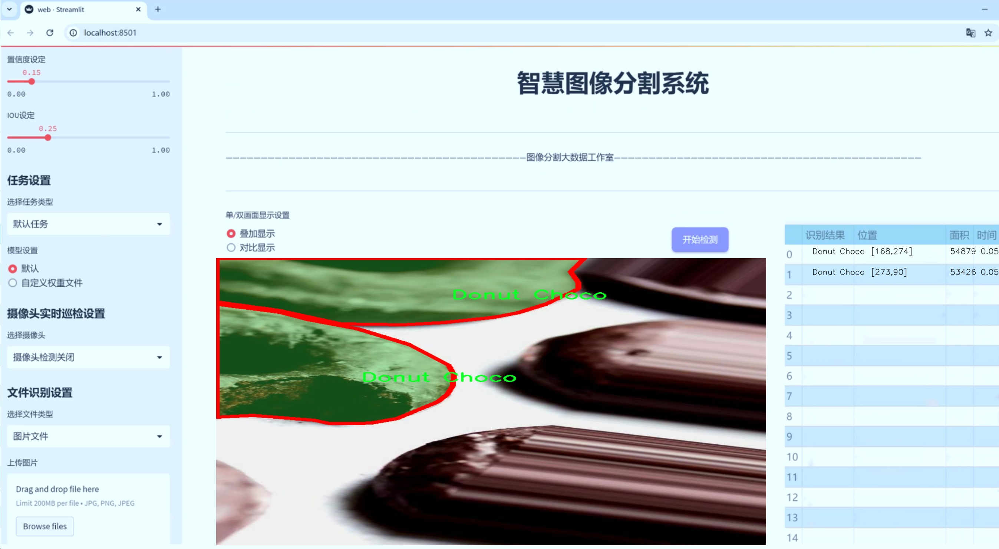
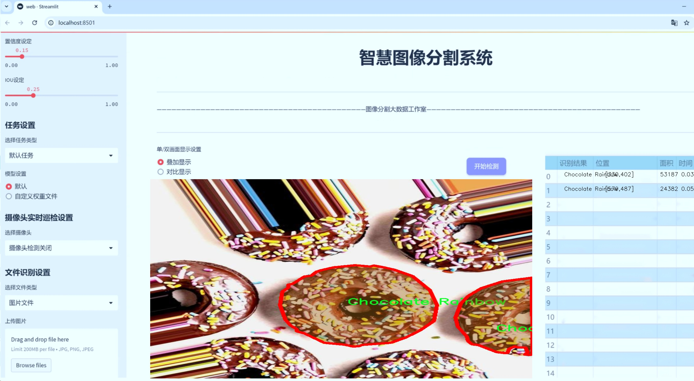
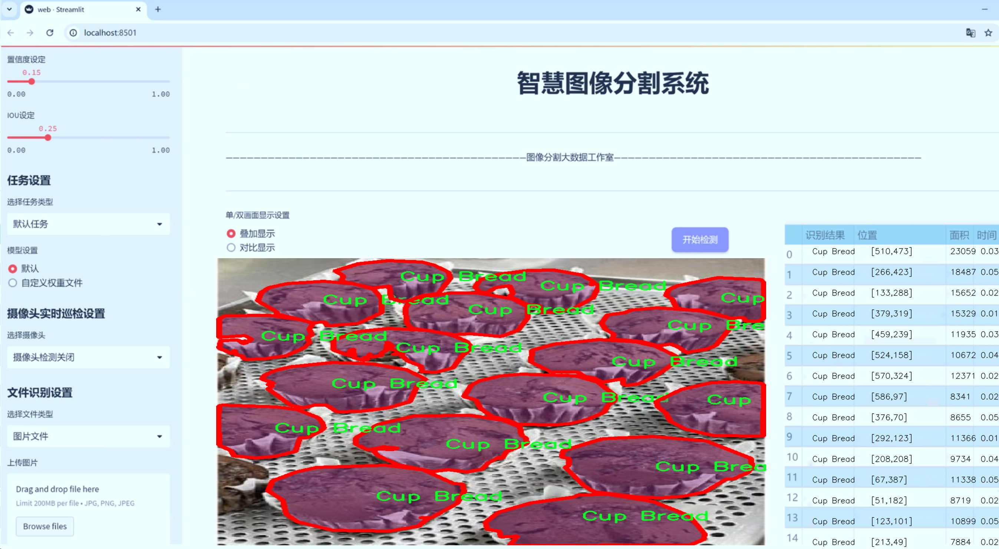
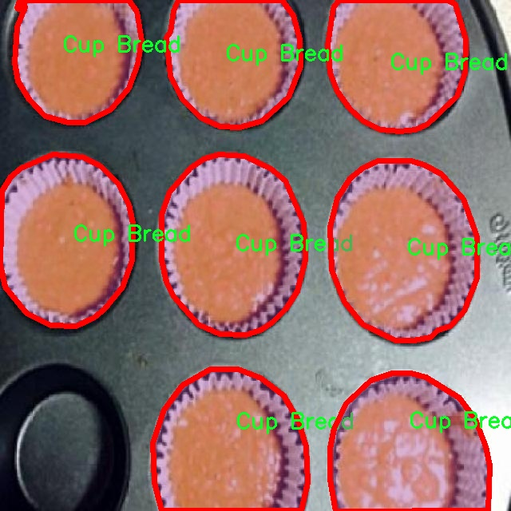
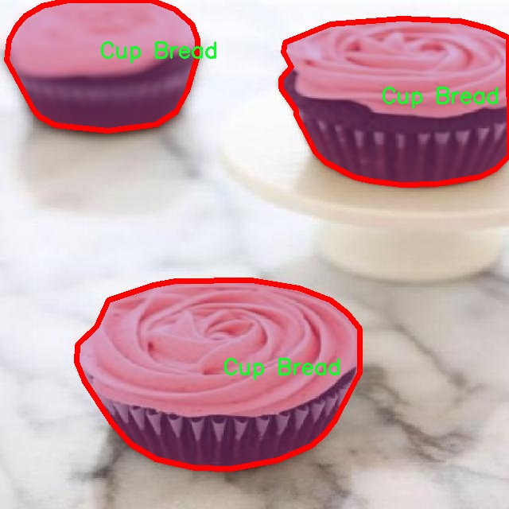
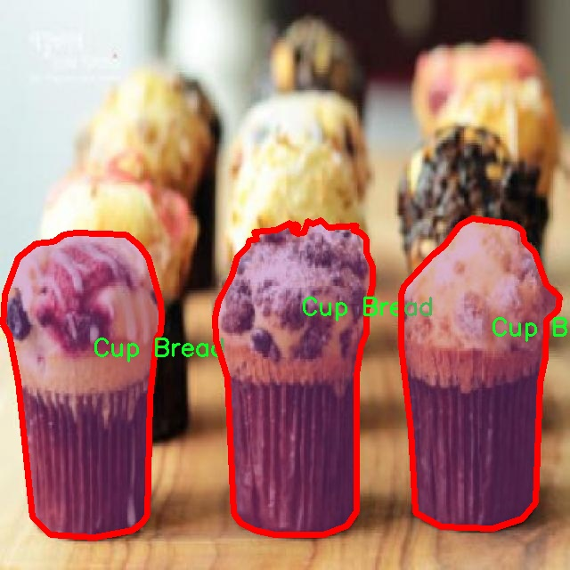
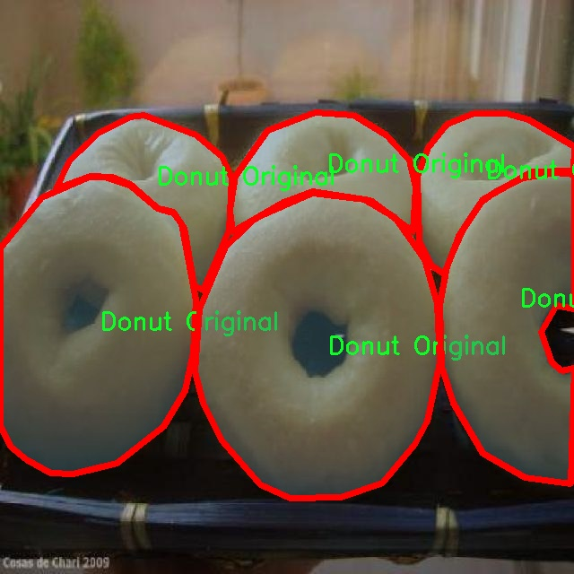
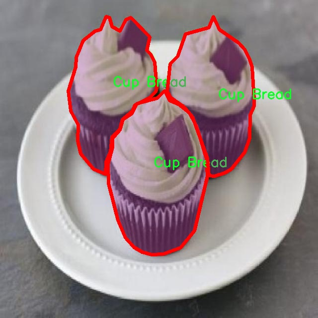

# 甜点图像分割系统： yolov8-seg-bifpn

### 1.研究背景与意义

[参考博客](https://gitee.com/YOLOv8_YOLOv11_Segmentation_Studio/projects)

[博客来源](https://kdocs.cn/l/cszuIiCKVNis)

研究背景与意义

随着人工智能技术的迅猛发展，计算机视觉领域在图像处理和分析方面取得了显著进展。特别是在物体检测与分割任务中，深度学习算法的应用使得这一领域的研究和应用得到了极大的推动。YOLO（You Only Look Once）系列模型作为一种高效的实时目标检测算法，因其快速性和准确性而受到广泛关注。YOLOv8作为该系列的最新版本，进一步提升了检测精度和速度，成为图像分割和物体识别领域的重要工具。然而，尽管YOLOv8在多种应用场景中表现出色，但在特定领域，如甜点图像的分割与识别，仍存在一些挑战。

甜点作为一种广受欢迎的食品，其种类繁多，外观各异，且在市场上具有较高的商业价值。准确地识别和分割不同类型的甜点，不仅对食品行业的自动化生产和质量控制具有重要意义，也为消费者提供了更为丰富的选择和体验。因此，开发一个基于改进YOLOv8的甜点图像分割系统，能够有效提升甜点的识别精度和效率，具有重要的理论价值和实际应用意义。

本研究所使用的数据集包含3600张甜点图像，涵盖21个不同的类别，如“Ballstal Cream”、“Choco Ball”、“Croissant”等。这些类别不仅代表了不同的甜点类型，还反映了甜点在形状、颜色和纹理等方面的多样性。通过对这些图像进行实例分割，能够帮助我们深入理解不同甜点的特征，从而为后续的自动化检测和分类提供数据支持。此外，针对甜点图像的特殊性，改进YOLOv8模型的结构和算法，将有助于提升其在复杂背景下的分割能力，进而增强模型的鲁棒性和适应性。

在当前的研究背景下，甜点图像分割系统的开发不仅有助于推动计算机视觉技术在食品行业的应用，还能够为相关领域的研究提供新的思路和方法。通过对甜点图像的深入分析，我们可以探索不同类型甜点的特征，进而为食品生产、销售和市场营销提供数据支持。同时，该系统的成功应用也将为其他领域的图像分割任务提供借鉴，推动相关技术的进一步发展。

综上所述，基于改进YOLOv8的甜点图像分割系统的研究，不仅具有重要的学术价值，也具备广泛的应用前景。通过该研究，我们希望能够在提高甜点图像分割精度的同时，为食品行业的智能化发展贡献力量，推动计算机视觉技术在实际应用中的落地与发展。

### 2.图片演示







注意：本项目提供完整的训练源码数据集和训练教程,由于此博客编辑较早,暂不提供权重文件（best.pt）,需要按照6.训练教程进行训练后实现上图效果。

### 3.视频演示

[3.1 视频演示](https://www.bilibili.com/video/BV1W16wYHEuk/)

### 4.数据集信息

##### 4.1 数据集类别数＆类别名

nc: 21
names: ['Ballstal Cream', 'Ballstal Cream Raibow', 'Choco Ball', 'Choco Caviar Chocolate', 'Choco Glazzy', 'Choco Meisisipi', 'Choco Nuttzy', 'Chocolate Butternut', 'Chocolate Rainbow', 'Croissant', 'Cup Bread', 'Donut Choco', 'Donut Original', 'Donut Strawberry', 'Mojiring Chocolate', 'Mojiring Plain', 'Mojiring Strawberry', 'Mojiring White', 'Original Glazzy', 'Strawberry  Rainbow', 'whiteRainbow']


##### 4.2 数据集信息简介

数据集信息展示

在本研究中，我们使用了名为“Project_Donut”的数据集，以训练和改进YOLOv8-seg模型，旨在实现高效的甜点图像分割。该数据集专注于多种甜点的图像，包含21个不同的类别，每个类别都代表了一种独特的甜点。这些类别的多样性不仅反映了甜点的丰富性，也为模型的训练提供了广泛的样本，使其能够更好地学习和识别不同类型的甜点。

“Project_Donut”数据集中的类别包括：Ballstal Cream、Ballstal Cream Rainbow、Choco Ball、Choco Caviar Chocolate、Choco Glazzy、Choco Meisisipi、Choco Nuttzy、Chocolate Butternut、Chocolate Rainbow、Croissant、Cup Bread、Donut Choco、Donut Original、Donut Strawberry、Mojiring Chocolate、Mojiring Plain、Mojiring Strawberry、Mojiring White、Original Glazzy、Strawberry Rainbow和whiteRainbow。这些类别涵盖了从经典的甜甜圈到创新的巧克力甜点，展现了甜点制作的多样性和创意。

数据集的构建过程中，考虑到了每种甜点的外观特征和色彩变化，以确保模型能够在不同的环境和条件下进行准确的图像分割。例如，Ballstal Cream和Ballstal Cream Rainbow之间的细微差别在于颜色和装饰，而Choco Nuttzy和Chocolate Butternut则在成分和外观上有所不同。这种细致的分类不仅为模型提供了丰富的训练数据，也增强了其在实际应用中的鲁棒性。

此外，数据集中的图像经过精心挑选和标注，确保每个类别的样本都具有良好的代表性。每张图像都包含了高质量的视觉信息，涵盖了不同的拍摄角度、光照条件和背景设置。这种多样性使得YOLOv8-seg模型在训练过程中能够学习到更为复杂的特征，从而在实际应用中能够更准确地进行甜点的图像分割。

在训练过程中，我们采用了数据增强技术，以进一步提升模型的泛化能力。通过对图像进行旋转、缩放、裁剪和颜色调整等操作，模型能够在更广泛的场景中进行学习，增强了其对新样本的适应能力。这一过程不仅提高了模型的准确性，也为未来的应用提供了更大的灵活性。

综上所述，“Project_Donut”数据集为YOLOv8-seg模型的训练提供了丰富的样本和多样的类别，使得模型能够在甜点图像分割任务中表现出色。通过对数据集的深入分析和有效利用，我们期望能够推动甜点图像处理技术的发展，为相关领域的研究和应用提供有力支持。











### 5.项目依赖环境部署教程（零基础手把手教学）

[5.1 环境部署教程链接（零基础手把手教学）](https://www.bilibili.com/video/BV1jG4Ve4E9t/?vd_source=bc9aec86d164b67a7004b996143742dc)


[5.2 安装Python虚拟环境创建和依赖库安装视频教程链接（零基础手把手教学）](https://www.bilibili.com/video/BV1nA4VeYEze/?vd_source=bc9aec86d164b67a7004b996143742dc)

### 6.手把手YOLOV8-seg训练视频教程（零基础手把手教学）

[6.1 手把手YOLOV8-seg训练视频教程（零基础小白有手就能学会）](https://www.bilibili.com/video/BV1cA4VeYETe/?vd_source=bc9aec86d164b67a7004b996143742dc)


按照上面的训练视频教程链接加载项目提供的数据集，运行train.py即可开始训练



     Epoch   gpu_mem       box       obj       cls    labels  img_size
     1/200     0G   0.01576   0.01955  0.007536        22      1280: 100%|██████████| 849/849 [14:42<00:00,  1.04s/it]
               Class     Images     Labels          P          R     mAP@.5 mAP@.5:.95: 100%|██████████| 213/213 [01:14<00:00,  2.87it/s]
                 all       3395      17314      0.994      0.957      0.0957      0.0843

     Epoch   gpu_mem       box       obj       cls    labels  img_size
     2/200     0G   0.01578   0.01923  0.007006        22      1280: 100%|██████████| 849/849 [14:44<00:00,  1.04s/it]
               Class     Images     Labels          P          R     mAP@.5 mAP@.5:.95: 100%|██████████| 213/213 [01:12<00:00,  2.95it/s]
                 all       3395      17314      0.996      0.956      0.0957      0.0845

     Epoch   gpu_mem       box       obj       cls    labels  img_size
     3/200     0G   0.01561    0.0191  0.006895        27      1280: 100%|██████████| 849/849 [10:56<00:00,  1.29it/s]
               Class     Images     Labels          P          R     mAP@.5 mAP@.5:.95: 100%|███████   | 187/213 [00:52<00:00,  4.04it/s]
                 all       3395      17314      0.996      0.957      0.0957      0.0845


### 7.50+种全套YOLOV8-seg创新点加载调参实验视频教程（一键加载写好的改进模型的配置文件）

[7.1 50+种全套YOLOV8-seg创新点加载调参实验视频教程（一键加载写好的改进模型的配置文件）](https://www.bilibili.com/video/BV1Hw4VePEXv/?vd_source=bc9aec86d164b67a7004b996143742dc)

### YOLOV8-seg算法简介

原始YOLOv8-seg算法原理

YOLOv8-seg算法是YOLO系列中的最新版本，专注于目标检测与分割任务，结合了高效的特征提取和精确的目标定位能力。该算法的设计理念是通过优化网络结构，提升检测精度与速度，同时保持模型的轻量化特性，以适应各种实际应用场景。

YOLOv8-seg的整体架构可以分为输入层、主干网络、颈部网络和头部网络四个主要部分。输入层负责对输入图像进行预处理，包括图像缩放、数据增强等，以确保输入数据符合模型的要求。数据增强策略如马赛克增强，不仅增加了训练样本的多样性，还提高了模型的鲁棒性。自适应锚框计算和自适应灰度填充则进一步优化了输入数据的质量，为后续的特征提取奠定了基础。

在主干网络部分，YOLOv8-seg采用了卷积操作进行特征提取。与以往版本相比，YOLOv8引入了C2f模块，这一模块借鉴了YOLOv7中的E-ELAN结构，通过跨层分支连接来增强模型的梯度流动性。这种设计使得特征提取过程更加高效，能够捕捉到更丰富的特征信息。每个卷积层都包含批归一化和SiLUR激活函数，确保了网络的稳定性和非线性表达能力。主干网络的末尾使用了空间金字塔池化（SPP）模块，通过多个最大池化层处理多尺度特征，进一步提升了网络的特征抽象能力，使得模型在面对不同尺度的目标时能够表现出色。

颈部网络的设计则采用了路径聚合网络（PAN）和特征金字塔网络（FPN）结构，旨在有效融合来自不同尺度的特征图信息。这一部分是YOLOv8-seg的关键所在，因为它确保了在目标检测和分割过程中，不同尺度的特征能够被充分利用。通过这种特征融合，模型能够更好地理解复杂场景中的目标关系，从而提高检测和分割的精度。

在头部网络中，YOLOv8-seg采用了解耦的检测头结构。与传统的耦合头不同，解耦头将分类和回归任务分开处理，分别通过两个并行的卷积分支进行计算。这种设计不仅提高了模型的灵活性，还简化了损失计算过程。分类分支使用二元交叉熵损失（BCELoss），而回归分支则结合了分布焦点损失（DFLoss）和完全交并比损失（CIOULoss），以提升边界框预测的精准性。这种解耦的设计使得模型在处理复杂场景时能够更好地平衡分类和定位的需求。

值得一提的是，YOLOv8-seg在目标检测的基础上，进一步扩展了分割能力。通过在网络结构中引入分割头，模型能够在进行目标检测的同时，对目标进行精确的像素级分割。这一特性使得YOLOv8-seg在自动驾驶、医疗影像分析等领域具有广泛的应用潜力。

在轻量化方面，YOLOv8-seg的设计充分考虑了模型的参数量和计算复杂度。YOLOv8n版本作为轻量化的代表，通过使用更小的C2F模块和优化的特征融合网络，显著减少了模型的参数量，同时保持了高效的检测速度。这种轻量化设计使得YOLOv8-seg能够在资源受限的设备上运行，满足实时性要求。

总的来说，YOLOv8-seg算法通过创新的网络结构和高效的特征处理机制，实现了目标检测与分割的双重任务。其在特征提取、特征融合和损失计算等方面的优化，使得模型在精度和速度上都取得了显著的提升。随着YOLOv8-seg的不断发展与应用，未来有望在更多实际场景中发挥重要作用，为计算机视觉领域带来新的突破。


### 9.系统功能展示（检测对象为举例，实际内容以本项目数据集为准）

图9.1.系统支持检测结果表格显示

  图9.2.系统支持置信度和IOU阈值手动调节

  图9.3.系统支持自定义加载权重文件best.pt(需要你通过步骤5中训练获得)

  图9.4.系统支持摄像头实时识别

  图9.5.系统支持图片识别

  图9.6.系统支持视频识别

  图9.7.系统支持识别结果文件自动保存

  图9.8.系统支持Excel导出检测结果数据


### 10.50+种全套YOLOV8-seg创新点原理讲解（非科班也可以轻松写刊发刊，V11版本正在科研待更新）

#### 10.1 由于篇幅限制，每个创新点的具体原理讲解就不一一展开，具体见下列网址中的创新点对应子项目的技术原理博客网址【Blog】：


[10.1 50+种全套YOLOV8-seg创新点原理讲解链接](https://gitee.com/qunmasj/good)

#### 10.2 部分改进模块原理讲解(完整的改进原理见上图和技术博客链接)【如果此小节的图加载失败可以通过CSDN或者Github搜索该博客的标题访问原始博客，原始博客图片显示正常】
### YOLOv8简介
YOLOv8目标检测算法继承了YOLOv1 系列的思考,是一种新型端到端的目标检测算法,尽管现在原始检测算法已经开源,但是鲜有发表的相关论文.YOLOv8的网络结构如图1[1所示,主要可分为Input输入端、Backbone 骨干神经网络、Neck混合特征网络层和 Head预测层网络共4个部分.

输入端( input)方法包含的功能模块有:马赛克( mosaic)数据增强、自适应锚框( anchor)计算、自适应图片缩放和 Mixup 数据增强['6].马赛克数据增强包括3种方式:缩放,色彩空间调整和马赛克增强.
该方法通过将4张图像进行随机的缩放﹑裁剪和打乱分布方式等操作来重新拼接图像,可丰富检测的数据集,具体步骤可见图2.随机缩放增加的许多小目标,非常适于解决卫星数据往往因距离目标过远从而导致图像中几乎都是小目标这一问题.在自适应锚框计算中, YOLO算法在每次训练数据之前,都会根据标注信息自动计算该数据集最合适的锚框尺寸,然后自动匹配最佳锚框.而自适应图片缩放只在检测时使用,由于不同场景需求不同,因而基于缩放系数YOLOv8提供了多尺度的不同大小模型.Mixup 数据增强鼓励模型对训练样本有一个线性的理解,具体做法是在目标检测中将两幅图像的像素值按照图像透明度的通道信息( alpha值)进行线性融合,对于标签box的处理直接采用拼接( con-cat)的方法拼接到一起.


Backbone骨干网络指用来提取图像特征的网络,整体结构包括注意力机制( focus)模块、跨阶段局部网络[ 7] ( cross stage partial network , CSP)和空间金字塔池化结构( spatial pyramid pooling,SPP).其中, Focus模块的作用是在图片进入 Backbone骨干网络前,对图片进行切片操作,即在一张图片中每隔一个像素取一个值,获得4张互补的图片,最后将新生成的图片经过卷积操作,得到没有信息丢失的2倍下采样特征图.YOLOv8使用了CSPNet 中的C2f网络,网络见图3,其中 CBS 就是卷积层,而瓶颈层( bottleneck layer)使用的是1* 1的卷积神经网络.C2f网络在保证轻量化的同时获得更加丰富的梯度流信息.而SPP结构是空间金字塔池化,能将任意大小的特征图转换成固定大小的特征向量,即把输入的特征地图划分为多个尺度,然后对每个图进行最大池化,再将提取的特征值拼接起来成为一维向量,输入SPP层获取分类.


Neck 结构如图4所示,它是由卷积层和C2f模块组成的的网络层,采用了路径聚合网络( path ag-gregation network ,PAN)和特征金字塔网络( featurepyramid networks , FPN)的结构对特征进行多尺度融合,目标是将图像特征传递到预测层.其中 PAN结构指图4左半边,它自底向上进行下采样,使顶层特征包含图像位置信息,两个特征最后进行融合,使不同尺寸的特征图都包含图像语义信息和图像特征信息，保证了网络对不同尺寸的图片的准确预测.而FPN结构指图4右半边,指通过自顶向下进行上采样,将高层特征与底层特征进行融合,从而同时利用低层特征的高分辨率和高层特征的丰富语义信息,并进行了多尺度特征的独立预测,对小物体的检测效果有明显的提升.从 FPN模块的基础上看,它增加了自底向上的特征金字塔结构,保留了更多的浅层位置特征,将整体特征提取能力进一步提升.


Head的结构如图5所示,在该结构中 YOLOv8采用了解耦检测头( decoupled-head )[ 18],因为分类和定位的关注点不同,分类更关注目标的纹理内容而定位更关注目标的边缘信息.因而解耦头结构考虑到分类和定位所关注的内容的不同,采用不同的分支来进行运算,提升了检测效果,相对应的回归头的通道数也改变了.


### MS-Block简介
实时目标检测，以YOLO系列为例，已在工业领域中找到重要应用，特别是在边缘设备（如无人机和机器人）中。与之前的目标检测器不同，实时目标检测器旨在在速度和准确性之间追求最佳平衡。为了实现这一目标，提出了大量的工作：从第一代DarkNet到CSPNet，再到最近的扩展ELAN，随着性能的快速增长，实时目标检测器的架构经历了巨大的变化。

尽管性能令人印象深刻，但在不同尺度上识别对象仍然是实时目标检测器面临的基本挑战。这促使作者设计了一个强大的编码器架构，用于学习具有表现力的多尺度特征表示。具体而言，作者从两个新的角度考虑为实时目标检测编码多尺度特征：

从局部视角出发，作者设计了一个具有简单而有效的分层特征融合策略的MS-Block。受到Res2Net的启发，作者在MS-Block中引入了多个分支来进行特征提取，但不同的是，作者使用了一个带有深度卷积的 Inverted Bottleneck Block块，以实现对大Kernel的高效利用。

从全局视角出发，作者提出随着网络加深逐渐增加卷积的Kernel-Size。作者在浅层使用小Kernel卷积来更高效地处理高分辨率特征。另一方面，在深层中，作者采用大Kernel卷积来捕捉广泛的信息。

基于以上设计原则，作者呈现了作者的实时目标检测器，称为YOLO-MS。为了评估作者的YOLO-MS的性能，作者在MS COCO数据集上进行了全面的实验。还提供了与其他最先进方法的定量比较，以展示作者方法的强大性能。如图1所示，YOLO-MS在计算性能平衡方面优于其他近期的实时目标检测器。


具体而言，YOLO-MS-XS在MS COCO上获得了43%+的AP得分，仅具有450万个可学习参数和8.7亿个FLOPs。YOLO-MS-S和YOLO-MS分别获得了46%+和51%+的AP，可学习参数分别为810万和2220万。此外，作者的工作还可以作为其他YOLO模型的即插即用模块。通常情况下，作者的方法可以将YOLOv8的AP从37%+显著提高到40%+，甚至还可以使用更少的参数和FLOPs。

CSP Block是一个基于阶段级梯度路径的网络，平衡了梯度组合和计算成本。它是广泛应用于YOLO系列的基本构建块。已经提出了几种变体，包括YOLOv4和YOLOv5中的原始版本，Scaled YOLOv4中的CSPVoVNet，YOLOv7中的ELAN，以及RTMDet中提出的大Kernel单元。作者在图2(a)和图2(b)中分别展示了原始CSP块和ELAN的结构。


上述实时检测器中被忽视的一个关键方面是如何在基本构建块中编码多尺度特征。其中一个强大的设计原则是Res2Net，它聚合了来自不同层次的特征以增强多尺度表示。然而，这一原则并没有充分探索大Kernel卷积的作用，而大Kernel卷积已经在基于CNN的视觉识别任务模型中证明有效。将大Kernel卷积纳入Res2Net的主要障碍在于它们引入的计算开销，因为构建块采用了标准卷积。在作者的方法中，作者提出用 Inverted Bottleneck Block替代标准的3 × 3卷积，以享受大Kernel卷积的好处。

#### MS-Block

基于前面的分析，参考该博客提出了一个带有分层特征融合策略的全新Block，称为MS-Block，以增强实时目标检测器在提取多尺度特征时的能力，同时保持快速的推理速度。

MS-Block的具体结构如图2(c)所示。假设是输入特征。通过1×1卷积的转换后，X的通道维度增加到n*C。然后，作者将X分割成n个不同的组，表示为，其中。为了降低计算成本，作者选择n为3。

注意，除了之外，每个其他组都经过一个 Inverted Bottleneck Block层，用表示，其中k表示Kernel-Size，以获得。的数学表示如下：


根据这个公式，作者不将 Inverted Bottleneck Block层连接到，使其作为跨阶段连接，并保留来自前面层的信息。最后，作者将所有分割连接在一起，并应用1×1卷积来在所有分割之间进行交互，每个分割都编码不同尺度的特征。当网络加深时，这个1×1卷积也用于调整通道数。

#### Heterogeneous Kernel Selection Protocol
除了构建块的设计外，作者还从宏观角度探讨了卷积的使用。之前的实时目标检测器在不同的编码器阶段采用了同质卷积（即具有相同Kernel-Size的卷积），但作者认为这不是提取多尺度语义信息的最佳选项。

在金字塔结构中，从检测器的浅阶段提取的高分辨率特征通常用于捕捉细粒度语义，将用于检测小目标。相反，来自网络较深阶段的低分辨率特征用于捕捉高级语义，将用于检测大目标。如果作者在所有阶段都采用统一的小Kernel卷积，深阶段的有效感受野（ERF）将受到限制，影响大目标的性能。在每个阶段中引入大Kernel卷积可以帮助解决这个问题。然而，具有大的ERF的大Kernel可以编码更广泛的区域，这增加了在小目标外部包含噪声信息的概率，并且降低了推理速度。

在这项工作中，作者建议在不同阶段中采用异构卷积，以帮助捕获更丰富的多尺度特征。具体来说，在编码器的第一个阶段中，作者采用最小Kernel卷积，而最大Kernel卷积位于最后一个阶段。随后，作者逐步增加中间阶段的Kernel-Size，使其与特征分辨率的增加保持一致。这种策略允许提取细粒度和粗粒度的语义信息，增强了编码器的多尺度特征表示能力。

正如图所示，作者将k的值分别分配给编码器中的浅阶段到深阶段，取值为3、5、7和9。作者将其称为异构Kernel选择（HKS）协议。


作者的HKS协议能够在深层中扩大感受野，而不会对浅层产生任何其他影响。第4节的图4支持了作者的分析。此外，HKS不仅有助于编码更丰富的多尺度特征，还确保了高效的推理。

如表1所示，将大Kernel卷积应用于高分辨率特征会产生较高的计算开销。然而，作者的HKS协议在低分辨率特征上采用大Kernel卷积，从而与仅使用大Kernel卷积相比，大大降低了计算成本。


在实践中，作者经验性地发现，采用HKS协议的YOLO-MS的推理速度几乎与仅使用深度可分离的3 × 3卷积相同。


如图所示，作者模型的Backbone由4个阶段组成，每个阶段后面跟随1个步长为2的3 × 3卷积进行下采样。在第3个阶段后，作者添加了1个SPP块，与RTMDet中一样。在作者的编码器上，作者使用PAFPN作为Neck来构建特征金字塔[31, 35]。它融合了从Backbone不同阶段提取的多尺度特征。Neck中使用的基本构建块也是作者的MS-Block，在其中使用3 × 3深度可分离卷积进行快速推理。

此外，为了在速度和准确性之间取得更好的平衡，作者将Backbone中多级特征的通道深度减半。作者提供了3个不同尺度的YOLO-MS变体，即YOLO-MS-XS、YOLO-MS-S和YOLO-MS。不同尺度的YOLO-MS的详细配置列在表2中。对于YOLO-MS的其他部分，作者将其保持与RTMDet相同。


### 11.项目核心源码讲解（再也不用担心看不懂代码逻辑）

#### 11.1 ultralytics\nn\extra_modules\rep_block.py

以下是对代码中最核心部分的分析和详细注释：

```python
import torch
import torch.nn as nn
import torch.nn.functional as F

# 定义一个模块，包含多个分支的卷积块
class DiverseBranchBlock(nn.Module):
    def __init__(self, in_channels, out_channels, kernel_size,
                 stride=1, padding=None, dilation=1, groups=1,
                 internal_channels_1x1_3x3=None,
                 deploy=False, single_init=False):
        super(DiverseBranchBlock, self).__init__()
        self.deploy = deploy  # 是否部署模式
        self.nonlinear = Conv.default_act  # 非线性激活函数
        self.kernel_size = kernel_size  # 卷积核大小
        self.out_channels = out_channels  # 输出通道数
        self.groups = groups  # 分组卷积的组数
        
        # 计算填充
        if padding is None:
            padding = autopad(kernel_size, padding, dilation)
        assert padding == kernel_size // 2  # 确保填充是正确的

        # 如果是部署模式，使用一个卷积层进行重参数化
        if deploy:
            self.dbb_reparam = nn.Conv2d(in_channels=in_channels, out_channels=out_channels, kernel_size=kernel_size, stride=stride,
                                      padding=padding, dilation=dilation, groups=groups, bias=True)
        else:
            # 原始卷积和批归一化
            self.dbb_origin = conv_bn(in_channels=in_channels, out_channels=out_channels, kernel_size=kernel_size, stride=stride, padding=padding, dilation=dilation, groups=groups)

            # 平均池化分支
            self.dbb_avg = nn.Sequential()
            if groups < out_channels:
                self.dbb_avg.add_module('conv',
                                        nn.Conv2d(in_channels=in_channels, out_channels=out_channels, kernel_size=1,
                                                  stride=1, padding=0, groups=groups, bias=False))
                self.dbb_avg.add_module('bn', BNAndPadLayer(pad_pixels=padding, num_features=out_channels))
                self.dbb_avg.add_module('avg', nn.AvgPool2d(kernel_size=kernel_size, stride=stride, padding=0))
                self.dbb_1x1 = conv_bn(in_channels=in_channels, out_channels=out_channels, kernel_size=1, stride=stride,
                                       padding=0, groups=groups)
            else:
                self.dbb_avg.add_module('avg', nn.AvgPool2d(kernel_size=kernel_size, stride=stride, padding=padding))

            self.dbb_avg.add_module('avgbn', nn.BatchNorm2d(out_channels))

            # 处理1x1和kxk卷积
            if internal_channels_1x1_3x3 is None:
                internal_channels_1x1_3x3 = in_channels if groups < out_channels else 2 * in_channels

            self.dbb_1x1_kxk = nn.Sequential()
            if internal_channels_1x1_3x3 == in_channels:
                self.dbb_1x1_kxk.add_module('idconv1', IdentityBasedConv1x1(channels=in_channels, groups=groups))
            else:
                self.dbb_1x1_kxk.add_module('conv1', nn.Conv2d(in_channels=in_channels, out_channels=internal_channels_1x1_3x3,
                                                            kernel_size=1, stride=1, padding=0, groups=groups, bias=False))
            self.dbb_1x1_kxk.add_module('bn1', BNAndPadLayer(pad_pixels=padding, num_features=internal_channels_1x1_3x3, affine=True))
            self.dbb_1x1_kxk.add_module('conv2', nn.Conv2d(in_channels=internal_channels_1x1_3x3, out_channels=out_channels,
                                                            kernel_size=kernel_size, stride=stride, padding=0, groups=groups, bias=False))
            self.dbb_1x1_kxk.add_module('bn2', nn.BatchNorm2d(out_channels))

    def forward(self, inputs):
        # 前向传播
        if hasattr(self, 'dbb_reparam'):
            return self.nonlinear(self.dbb_reparam(inputs))  # 如果是部署模式，直接使用重参数化的卷积

        out = self.dbb_origin(inputs)  # 原始卷积
        if hasattr(self, 'dbb_1x1'):
            out += self.dbb_1x1(inputs)  # 加上1x1卷积的输出
        out += self.dbb_avg(inputs)  # 加上平均池化的输出
        out += self.dbb_1x1_kxk(inputs)  # 加上kxk卷积的输出
        return self.nonlinear(out)  # 最后经过非线性激活函数

    def switch_to_deploy(self):
        # 切换到部署模式
        if hasattr(self, 'dbb_reparam'):
            return
        kernel, bias = self.get_equivalent_kernel_bias()  # 获取等效的卷积核和偏置
        self.dbb_reparam = nn.Conv2d(in_channels=self.dbb_origin.conv.in_channels, out_channels=self.dbb_origin.conv.out_channels,
                                     kernel_size=self.dbb_origin.conv.kernel_size, stride=self.dbb_origin.conv.stride,
                                     padding=self.dbb_origin.conv.padding, dilation=self.dbb_origin.conv.dilation, groups=self.dbb_origin.conv.groups, bias=True)
        self.dbb_reparam.weight.data = kernel  # 设置卷积核
        self.dbb_reparam.bias.data = bias  # 设置偏置
        for para in self.parameters():
            para.detach_()  # 分离参数
        self.__delattr__('dbb_origin')  # 删除原始卷积
        self.__delattr__('dbb_avg')  # 删除平均池化
        if hasattr(self, 'dbb_1x1'):
            self.__delattr__('dbb_1x1')  # 删除1x1卷积
        self.__delattr__('dbb_1x1_kxk')  # 删除kxk卷积

    def get_equivalent_kernel_bias(self):
        # 获取等效的卷积核和偏置
        k_origin, b_origin = transI_fusebn(self.dbb_origin.conv.weight, self.dbb_origin.bn)
        # 处理其他分支的卷积核和偏置
        # ...（省略具体实现细节）
        return transII_addbranch((k_origin, k_1x1, k_1x1_kxk_merged, k_1x1_avg_merged), (b_origin, b_1x1, b_1x1_kxk_merged, b_1x1_avg_merged))

```

### 代码核心部分分析
1. **DiverseBranchBlock 类**: 这是一个自定义的神经网络模块，包含多个卷积分支。它支持在训练和部署模式之间切换。
2. **构造函数**: 初始化卷积层、批归一化层和其他分支（如平均池化和1x1卷积）。
3. **前向传播**: 定义了如何通过各个分支计算输出。
4. **切换到部署模式**: 在部署模式下，使用重参数化的卷积层来简化模型。
5. **获取等效卷积核和偏置**: 计算和返回等效的卷积核和偏置，以便在部署时使用。

以上是对代码中核心部分的详细分析和注释。

这个文件是一个实现了多分支卷积块的PyTorch模块，主要用于深度学习中的卷积神经网络（CNN）。文件中定义了多个函数和类，主要包括一些卷积操作的转换函数、批归一化和填充的组合层，以及一个核心的多分支卷积块类 `DiverseBranchBlock`。

首先，文件导入了必要的库，包括 PyTorch 的 `torch` 和 `torch.nn`，以及 NumPy。接着，定义了一些用于卷积和批归一化的转换函数。这些函数的主要作用是将卷积核和批归一化层的参数进行融合，简化后续的计算。比如，`transI_fusebn` 函数将卷积核和批归一化的权重进行融合，返回新的卷积核和偏置。

`DiverseBranchBlock` 类是这个文件的核心部分，它继承自 `nn.Module`。在初始化方法中，定义了多个卷积层和批归一化层。根据传入的参数，模块可以选择是否使用不同的分支结构来处理输入数据。该模块支持多种配置，包括是否进行部署、是否使用单一初始化等。

在 `forward` 方法中，模块定义了前向传播的逻辑。它会根据是否存在重参数化卷积层（`dbb_reparam`）来决定使用哪种方式进行计算。如果存在重参数化层，则直接使用该层进行计算；否则，使用原始的卷积层和其他分支的输出进行加和，最后通过非线性激活函数进行处理。

此外，类中还包含了一些辅助方法，例如 `get_equivalent_kernel_bias` 用于获取等效的卷积核和偏置，`switch_to_deploy` 用于切换到部署模式，`init_gamma` 和 `single_init` 用于初始化参数。

总的来说，这个文件实现了一个灵活且高效的多分支卷积块，适用于各种深度学习任务，特别是在需要多尺度特征提取的场景中。通过不同的分支结构，该模块能够有效地捕捉输入数据的多样性，从而提高模型的表现。

#### 11.2 ultralytics\nn\modules\conv.py

以下是代码中最核心的部分，并附上详细的中文注释：

```python
import torch
import torch.nn as nn

def autopad(k, p=None, d=1):  # kernel, padding, dilation
    """自动计算填充以保持输出形状不变。"""
    if d > 1:
        # 如果有膨胀(dilation)，计算实际的卷积核大小
        k = d * (k - 1) + 1 if isinstance(k, int) else [d * (x - 1) + 1 for x in k]
    if p is None:
        # 如果没有指定填充，自动计算填充
        p = k // 2 if isinstance(k, int) else [x // 2 for x in k]
    return p

class Conv(nn.Module):
    """标准卷积层，包含卷积、批归一化和激活函数。"""
    default_act = nn.SiLU()  # 默认激活函数为SiLU

    def __init__(self, c1, c2, k=1, s=1, p=None, g=1, d=1, act=True):
        """初始化卷积层，设置输入输出通道、卷积核大小、步幅、填充、分组、膨胀和激活函数。"""
        super().__init__()
        self.conv = nn.Conv2d(c1, c2, k, s, autopad(k, p, d), groups=g, dilation=d, bias=False)  # 卷积层
        self.bn = nn.BatchNorm2d(c2)  # 批归一化层
        self.act = self.default_act if act is True else act if isinstance(act, nn.Module) else nn.Identity()  # 激活函数

    def forward(self, x):
        """前向传播：应用卷积、批归一化和激活函数。"""
        return self.act(self.bn(self.conv(x)))

class DWConv(Conv):
    """深度可分离卷积层，继承自标准卷积层。"""

    def __init__(self, c1, c2, k=1, s=1, d=1, act=True):
        """初始化深度可分离卷积层，设置输入输出通道、卷积核大小、步幅、膨胀和激活函数。"""
        super().__init__(c1, c2, k, s, g=math.gcd(c1, c2), d=d, act=act)  # 分组卷积的组数为输入和输出通道数的最大公约数

class ConvTranspose(nn.Module):
    """转置卷积层。"""
    default_act = nn.SiLU()  # 默认激活函数为SiLU

    def __init__(self, c1, c2, k=2, s=2, p=0, bn=True, act=True):
        """初始化转置卷积层，设置输入输出通道、卷积核大小、步幅、填充、批归一化和激活函数。"""
        super().__init__()
        self.conv_transpose = nn.ConvTranspose2d(c1, c2, k, s, p, bias=not bn)  # 转置卷积层
        self.bn = nn.BatchNorm2d(c2) if bn else nn.Identity()  # 批归一化层
        self.act = self.default_act if act is True else act if isinstance(act, nn.Module) else nn.Identity()  # 激活函数

    def forward(self, x):
        """前向传播：应用转置卷积、批归一化和激活函数。"""
        return self.act(self.bn(self.conv_transpose(x)))

class ChannelAttention(nn.Module):
    """通道注意力模块。"""

    def __init__(self, channels: int) -> None:
        """初始化通道注意力模块，设置通道数。"""
        super().__init__()
        self.pool = nn.AdaptiveAvgPool2d(1)  # 自适应平均池化
        self.fc = nn.Conv2d(channels, channels, 1, 1, 0, bias=True)  # 1x1卷积
        self.act = nn.Sigmoid()  # 激活函数为Sigmoid

    def forward(self, x: torch.Tensor) -> torch.Tensor:
        """前向传播：应用通道注意力机制。"""
        return x * self.act(self.fc(self.pool(x)))  # 输入乘以经过注意力机制的输出

class SpatialAttention(nn.Module):
    """空间注意力模块。"""

    def __init__(self, kernel_size=7):
        """初始化空间注意力模块，设置卷积核大小。"""
        super().__init__()
        assert kernel_size in (3, 7), 'kernel size must be 3 or 7'  # 卷积核大小只能为3或7
        padding = 3 if kernel_size == 7 else 1
        self.cv1 = nn.Conv2d(2, 1, kernel_size, padding=padding, bias=False)  # 卷积层
        self.act = nn.Sigmoid()  # 激活函数为Sigmoid

    def forward(self, x):
        """前向传播：应用空间注意力机制。"""
        return x * self.act(self.cv1(torch.cat([torch.mean(x, 1, keepdim=True), torch.max(x, 1, keepdim=True)[0]], 1)))  # 输入乘以经过注意力机制的输出

class CBAM(nn.Module):
    """卷积块注意力模块。"""

    def __init__(self, c1, kernel_size=7):
        """初始化CBAM模块，设置输入通道和卷积核大小。"""
        super().__init__()
        self.channel_attention = ChannelAttention(c1)  # 通道注意力
        self.spatial_attention = SpatialAttention(kernel_size)  # 空间注意力

    def forward(self, x):
        """前向传播：依次应用通道注意力和空间注意力。"""
        return self.spatial_attention(self.channel_attention(x))
```

### 代码核心部分解释：
1. **自动填充函数 (`autopad`)**：用于计算卷积操作中所需的填充，以确保输出的空间维度与输入相同。
2. **卷积层 (`Conv`)**：实现了标准的卷积操作，包括卷积、批归一化和激活函数的组合。
3. **深度可分离卷积 (`DWConv`)**：继承自标准卷积，使用分组卷积的方式实现深度可分离卷积。
4. **转置卷积层 (`ConvTranspose`)**：实现了转置卷积的功能，常用于上采样。
5. **通道注意力模块 (`ChannelAttention`)**：通过自适应平均池化和1x1卷积实现通道注意力机制，增强重要特征通道的表达能力。
6. **空间注意力模块 (`SpatialAttention`)**：通过卷积操作和激活函数实现空间注意力机制，强调重要的空间区域。
7. **CBAM模块 (`CBAM`)**：结合通道注意力和空间注意力的模块，增强特征表示能力。

这些模块是构建深度学习模型，尤其是卷积神经网络的重要组成部分。

这个程序文件是一个用于实现卷积模块的代码，主要用于Ultralytics YOLO（You Only Look Once）模型。文件中定义了多个卷积相关的类和函数，提供了不同类型的卷积操作，旨在提高模型的性能和灵活性。

首先，文件导入了必要的库，包括数学库、NumPy和PyTorch。然后，定义了一个名为`autopad`的函数，用于自动计算卷积操作所需的填充量，以确保输出的形状与输入相同。

接下来，定义了多个卷积类。`Conv`类是标准卷积的实现，包含卷积层、批归一化层和激活函数。它的`forward`方法依次应用卷积、批归一化和激活函数，返回处理后的张量。`Conv2`类是对`Conv`类的简化，增加了一个1x1的卷积层，以提高特征提取能力。

`LightConv`类实现了一种轻量级卷积，结合了1x1卷积和深度卷积（`DWConv`），以减少计算量。`DWConv`类则实现了深度卷积，适用于输入和输出通道数相同的情况。

`ConvTranspose`类和`DWConvTranspose2d`类分别实现了转置卷积和深度转置卷积，常用于上采样操作。`Focus`类则用于将输入的空间信息聚合到通道维度中，适用于YOLO模型的特征提取。

`GhostConv`类实现了Ghost卷积，这是一种高效的卷积方法，通过将特征图的维度减少一半来降低计算量，同时保持性能。`RepConv`类则是一个基础的重复卷积块，支持训练和推理状态，主要用于RT-DETR模型。

此外，文件中还定义了注意力机制模块，包括`ChannelAttention`和`SpatialAttention`，用于增强特征图的表达能力。`CBAM`类结合了通道注意力和空间注意力，进一步提升特征提取的效果。

最后，`Concat`类用于在指定维度上连接多个张量，方便在模型中处理多通道特征。

总体而言，这个文件实现了多种卷积和注意力机制的模块，为YOLO模型提供了强大的特征提取和处理能力。通过这些模块，模型能够更有效地学习和识别图像中的目标。

#### 11.3 ultralytics\nn\extra_modules\afpn.py

以下是保留的核心代码部分，并添加了详细的中文注释：

```python
import torch
import torch.nn as nn
import torch.nn.functional as F
from ..modules.conv import Conv

# 定义基本的卷积块
class BasicBlock(nn.Module):
    def __init__(self, filter_in, filter_out):
        super(BasicBlock, self).__init__()
        # 定义两个卷积层
        self.conv1 = Conv(filter_in, filter_out, 3)  # 第一个卷积层，3x3卷积
        self.conv2 = Conv(filter_out, filter_out, 3, act=False)  # 第二个卷积层，3x3卷积，不使用激活函数

    def forward(self, x):
        residual = x  # 保存输入，用于残差连接
        out = self.conv1(x)  # 通过第一个卷积层
        out = self.conv2(out)  # 通过第二个卷积层
        out += residual  # 添加残差
        return self.conv1.act(out)  # 返回激活后的输出

# 定义上采样模块
class Upsample(nn.Module):
    def __init__(self, in_channels, out_channels, scale_factor=2):
        super(Upsample, self).__init__()
        # 定义上采样操作
        self.upsample = nn.Sequential(
            Conv(in_channels, out_channels, 1),  # 1x1卷积层
            nn.Upsample(scale_factor=scale_factor, mode='bilinear')  # 双线性插值上采样
        )

    def forward(self, x):
        return self.upsample(x)  # 前向传播

# 定义下采样模块（x2, x4, x8）
class Downsample_x2(nn.Module):
    def __init__(self, in_channels, out_channels):
        super(Downsample_x2, self).__init__()
        self.downsample = Conv(in_channels, out_channels, 2, 2, 0)  # 2x2卷积下采样

    def forward(self, x):
        return self.downsample(x)  # 前向传播

class Downsample_x4(nn.Module):
    def __init__(self, in_channels, out_channels):
        super(Downsample_x4, self).__init__()
        self.downsample = Conv(in_channels, out_channels, 4, 4, 0)  # 4x4卷积下采样

    def forward(self, x):
        return self.downsample(x)  # 前向传播

class Downsample_x8(nn.Module):
    def __init__(self, in_channels, out_channels):
        super(Downsample_x8, self).__init__()
        self.downsample = Conv(in_channels, out_channels, 8, 8, 0)  # 8x8卷积下采样

    def forward(self, x):
        return self.downsample(x)  # 前向传播

# 定义自适应特征融合模块（ASFF）
class ASFF_2(nn.Module):
    def __init__(self, inter_dim=512):
        super(ASFF_2, self).__init__()
        self.inter_dim = inter_dim
        compress_c = 8  # 压缩通道数

        # 定义权重卷积层
        self.weight_level_1 = Conv(self.inter_dim, compress_c, 1)
        self.weight_level_2 = Conv(self.inter_dim, compress_c, 1)
        self.weight_levels = nn.Conv2d(compress_c * 2, 2, kernel_size=1)  # 计算权重
        self.conv = Conv(self.inter_dim, self.inter_dim, 3)  # 最后的卷积层

    def forward(self, input1, input2):
        # 计算权重
        level_1_weight_v = self.weight_level_1(input1)
        level_2_weight_v = self.weight_level_2(input2)
        levels_weight_v = torch.cat((level_1_weight_v, level_2_weight_v), 1)  # 拼接权重
        levels_weight = self.weight_levels(levels_weight_v)  # 计算最终权重
        levels_weight = F.softmax(levels_weight, dim=1)  # 归一化权重

        # 融合特征
        fused_out_reduced = input1 * levels_weight[:, 0:1, :, :] + input2 * levels_weight[:, 1:2, :, :]
        out = self.conv(fused_out_reduced)  # 通过卷积层
        return out  # 返回融合后的输出

# 定义AFPN模块
class AFPN_P345(nn.Module):
    def __init__(self, in_channels=[256, 512, 1024], out_channels=256, factor=4):
        super(AFPN_P345, self).__init__()
        # 定义输入通道的卷积层
        self.conv0 = Conv(in_channels[0], in_channels[0] // factor, 1)
        self.conv1 = Conv(in_channels[1], in_channels[1] // factor, 1)
        self.conv2 = Conv(in_channels[2], in_channels[2] // factor, 1)

        # 定义主干网络
        self.body = BlockBody_P345([in_channels[0] // factor, in_channels[1] // factor, in_channels[2] // factor])

        # 定义输出通道的卷积层
        self.conv00 = Conv(in_channels[0] // factor, out_channels, 1)
        self.conv11 = Conv(in_channels[1] // factor, out_channels, 1)
        self.conv22 = Conv(in_channels[2] // factor, out_channels, 1)

    def forward(self, x):
        x0, x1, x2 = x  # 输入三个特征图
        x0 = self.conv0(x0)  # 通过卷积层
        x1 = self.conv1(x1)
        x2 = self.conv2(x2)

        out0, out1, out2 = self.body([x0, x1, x2])  # 通过主干网络
        out0 = self.conv00(out0)  # 输出卷积
        out1 = self.conv11(out1)
        out2 = self.conv22(out2)
        return [out0, out1, out2]  # 返回输出特征图
```

### 代码说明
1. **BasicBlock**: 实现了一个基本的卷积块，包含两个卷积层和残差连接。
2. **Upsample 和 Downsample**: 定义了上采样和下采样模块，使用卷积和插值方法调整特征图的尺寸。
3. **ASFF_2**: 自适应特征融合模块，计算输入特征图的权重并融合特征。
4. **AFPN_P345**: 实现了一个特征金字塔网络（AFPN），用于处理多尺度特征图的融合和输出。

这些核心部分是构建更复杂网络的基础，主要用于特征提取和融合。

这个程序文件定义了一些用于构建特征金字塔网络（FPN）的模块，主要用于计算机视觉任务中的特征提取和融合。文件中包含多个类，每个类实现了不同的功能，下面对这些类进行逐一说明。

首先，`BasicBlock`类是一个基本的卷积块，包含两个卷积层，第二个卷积层不使用激活函数。它在前向传播中将输入与卷积的输出相加，形成残差连接。

接下来，`Upsample`和`Downsample_x2`、`Downsample_x4`、`Downsample_x8`类分别实现了上采样和不同倍数的下采样操作。这些类使用卷积层和上采样层（双线性插值）或下采样层（通过卷积实现）来改变特征图的尺寸。

`ASFF_2`、`ASFF_3`和`ASFF_4`类实现了自适应特征融合模块（ASFF），它们根据输入特征图的权重对多个输入进行加权融合。每个类的构造函数中定义了用于计算权重的卷积层，并在前向传播中计算权重后进行特征融合。

`BlockBody_P345`和`BlockBody_P2345`类是特征金字塔网络的主体部分，分别处理3个和4个尺度的特征图。它们通过组合多个卷积块、上采样和下采样操作，以及自适应特征融合模块，构建了一个复杂的特征提取网络。每个尺度的特征图都经过多个卷积块处理，并通过自适应特征融合模块与其他尺度的特征图进行融合。

`AFPN_P345`和`AFPN_P2345`类是特征金字塔网络的最终实现，负责将输入特征图通过一系列卷积和特征融合模块处理后输出特征图。它们的构造函数中初始化了卷积层，并在前向传播中依次处理输入特征图，最终返回融合后的特征图。

最后，`BlockBody_P345_Custom`、`BlockBody_P2345_Custom`、`AFPN_P345_Custom`和`AFPN_P2345_Custom`类是上述类的自定义版本，允许用户指定不同的卷积块类型，以便在构建网络时具有更大的灵活性。

总体而言，这个文件实现了一个灵活且强大的特征金字塔网络结构，适用于各种计算机视觉任务，特别是在目标检测和分割等领域。通过自适应特征融合和多尺度特征处理，这些模块能够有效地提取和融合不同尺度的特征信息。

#### 11.4 ultralytics\nn\modules\utils.py

以下是经过简化和注释的核心代码部分：

```python
import torch
import torch.nn.functional as F

def inverse_sigmoid(x, eps=1e-5):
    """计算张量的反sigmoid函数。"""
    # 限制x的范围在0到1之间
    x = x.clamp(min=0, max=1)
    # 为了避免log(0)，对x进行限制
    x1 = x.clamp(min=eps)  # x的下限
    x2 = (1 - x).clamp(min=eps)  # 1-x的下限
    # 返回反sigmoid的计算结果
    return torch.log(x1 / x2)

def multi_scale_deformable_attn_pytorch(value: torch.Tensor, value_spatial_shapes: torch.Tensor,
                                        sampling_locations: torch.Tensor,
                                        attention_weights: torch.Tensor) -> torch.Tensor:
    """
    多尺度可变形注意力机制。

    参数:
    - value: 输入特征张量
    - value_spatial_shapes: 输入特征的空间形状
    - sampling_locations: 采样位置
    - attention_weights: 注意力权重

    返回:
    - output: 经过多尺度可变形注意力机制处理后的输出张量
    """

    # 获取输入张量的维度
    bs, _, num_heads, embed_dims = value.shape
    _, num_queries, num_heads, num_levels, num_points, _ = sampling_locations.shape
    
    # 将输入特征张量根据空间形状进行分割
    value_list = value.split([H_ * W_ for H_, W_ in value_spatial_shapes], dim=1)
    
    # 计算采样网格
    sampling_grids = 2 * sampling_locations - 1
    sampling_value_list = []
    
    # 遍历每个尺度的特征
    for level, (H_, W_) in enumerate(value_spatial_shapes):
        # 对每个尺度的特征进行处理
        value_l_ = (value_list[level].flatten(2).transpose(1, 2).reshape(bs * num_heads, embed_dims, H_, W_))
        
        # 获取当前尺度的采样网格
        sampling_grid_l_ = sampling_grids[:, :, :, level].transpose(1, 2).flatten(0, 1)
        
        # 使用grid_sample进行双线性插值采样
        sampling_value_l_ = F.grid_sample(value_l_,
                                          sampling_grid_l_,
                                          mode='bilinear',
                                          padding_mode='zeros',
                                          align_corners=False)
        sampling_value_list.append(sampling_value_l_)
    
    # 处理注意力权重
    attention_weights = attention_weights.transpose(1, 2).reshape(bs * num_heads, 1, num_queries,
                                                                  num_levels * num_points)
    
    # 计算最终输出
    output = ((torch.stack(sampling_value_list, dim=-2).flatten(-2) * attention_weights).sum(-1).view(
        bs, num_heads * embed_dims, num_queries))
    
    return output.transpose(1, 2).contiguous()  # 返回转置后的输出
```

### 代码注释说明：
1. **inverse_sigmoid** 函数：计算反sigmoid函数，确保输入在0到1之间，并避免计算log(0)。
2. **multi_scale_deformable_attn_pytorch** 函数：实现多尺度可变形注意力机制，输入特征经过空间分割、采样和加权处理，最终输出经过转置的结果。每个步骤都有详细的注释，解释了参数的含义和操作的目的。

这个程序文件是一个用于实现多尺度可变形注意力机制的工具模块，主要用于深度学习中的目标检测任务，特别是与YOLO（You Only Look Once）模型相关的实现。文件中包含了一些常用的工具函数和多尺度可变形注意力的实现。

首先，文件导入了一些必要的库，包括`copy`、`math`、`numpy`和`torch`等。`torch`是PyTorch深度学习框架的核心库，提供了张量操作和神经网络模块的构建。

接下来，定义了几个函数。`_get_clones(module, n)`函数用于创建一个给定模块的克隆列表，返回一个`nn.ModuleList`，其中包含了`n`个深拷贝的模块。这在构建具有多个相同层的网络时非常有用。

`bias_init_with_prob(prior_prob=0.01)`函数用于根据给定的概率值初始化卷积或全连接层的偏置值。它使用了负对数几率的公式，将概率转换为偏置值。

`linear_init_(module)`函数用于初始化线性模块的权重和偏置。它使用均匀分布在一个特定的范围内初始化权重，并且如果模块有偏置，则也对偏置进行相同的初始化。

`inverse_sigmoid(x, eps=1e-5)`函数计算张量的反sigmoid函数。它将输入值限制在0到1之间，并通过对数运算返回反sigmoid值。

最后，`multi_scale_deformable_attn_pytorch`函数实现了多尺度可变形注意力机制。该函数接受多个输入参数，包括`value`（输入特征）、`value_spatial_shapes`（特征的空间形状）、`sampling_locations`（采样位置）和`attention_weights`（注意力权重）。函数内部首先获取输入的维度信息，然后将输入特征根据空间形状进行分割。接着，计算采样网格并通过`F.grid_sample`函数对特征进行采样。最后，将采样得到的特征与注意力权重相乘并求和，返回最终的输出。

整体来看，这个模块提供了一些基础的工具函数和多尺度可变形注意力的实现，旨在为YOLO模型的目标检测任务提供支持。

#### 11.5 ultralytics\engine\predictor.py

以下是经过简化和注释的核心代码部分，主要集中在YOLO模型的预测功能上：

```python
import platform
from pathlib import Path
import cv2
import numpy as np
import torch
from ultralytics.cfg import get_cfg, get_save_dir
from ultralytics.data import load_inference_source
from ultralytics.nn.autobackend import AutoBackend
from ultralytics.utils import LOGGER, callbacks, select_device, smart_inference_mode

class BasePredictor:
    """
    BasePredictor类用于创建YOLO模型的预测器。
    """

    def __init__(self, cfg=None, overrides=None, _callbacks=None):
        """
        初始化BasePredictor类。

        Args:
            cfg (str, optional): 配置文件路径，默认为None。
            overrides (dict, optional): 配置覆盖，默认为None。
        """
        self.args = get_cfg(cfg, overrides)  # 获取配置
        self.save_dir = get_save_dir(self.args)  # 获取保存结果的目录
        self.model = None  # 模型初始化为None
        self.device = None  # 设备初始化为None
        self.callbacks = _callbacks or callbacks.get_default_callbacks()  # 初始化回调函数

    def preprocess(self, im):
        """
        对输入图像进行预处理。

        Args:
            im (torch.Tensor | List(np.ndarray)): 输入图像。

        Returns:
            torch.Tensor: 处理后的图像。
        """
        im = torch.from_numpy(im).to(self.device)  # 转换为Tensor并移动到指定设备
        im = im.float() / 255.0  # 将像素值归一化到[0, 1]
        return im

    def inference(self, im):
        """对给定图像进行推理。"""
        return self.model(im)  # 使用模型进行推理

    def __call__(self, source=None, model=None, stream=False):
        """执行推理。"""
        self.setup_model(model)  # 设置模型
        self.setup_source(source)  # 设置数据源
        for batch in self.dataset:  # 遍历数据集
            im = self.preprocess(batch)  # 预处理图像
            preds = self.inference(im)  # 进行推理
            yield preds  # 返回推理结果

    def setup_model(self, model):
        """初始化YOLO模型并设置为评估模式。"""
        self.model = AutoBackend(model)  # 使用AutoBackend加载模型
        self.device = select_device(self.args.device)  # 选择设备
        self.model.eval()  # 设置模型为评估模式

    def setup_source(self, source):
        """设置数据源。"""
        self.dataset = load_inference_source(source)  # 加载数据源

# 下面的代码可以用于实际的推理调用
# predictor = BasePredictor(cfg='path/to/config.yaml')
# for result in predictor(source='path/to/image_or_video'):
#     print(result)  # 输出推理结果
```

### 代码说明：
1. **类的定义**：`BasePredictor`类是YOLO模型的基础预测器，负责模型的初始化、图像的预处理、推理和结果的返回。
2. **初始化方法**：在`__init__`方法中，获取配置并初始化模型和设备。
3. **预处理方法**：`preprocess`方法将输入图像转换为Tensor，并进行归一化处理。
4. **推理方法**：`inference`方法使用模型对预处理后的图像进行推理。
5. **调用方法**：`__call__`方法使得该类的实例可以像函数一样被调用，执行推理过程。
6. **模型和数据源设置**：`setup_model`和`setup_source`方法分别用于初始化模型和设置数据源。

以上代码为YOLO模型的核心预测功能，适合用于图像或视频的目标检测任务。

这个程序文件是Ultralytics YOLO（You Only Look Once）模型的预测器，主要用于在图像、视频、目录、流媒体等多种来源上进行目标检测。文件中包含了多个类和方法，以下是对其主要功能和结构的讲解。

首先，文件导入了一些必要的库，包括`cv2`（OpenCV）、`numpy`和`torch`，以及Ultralytics库中的一些模块。这些模块提供了配置、数据加载、模型自动选择、工具函数等功能。

文件中定义了一个名为`BasePredictor`的类，这是一个用于创建预测器的基类。该类的构造函数初始化了一些重要的属性，包括配置参数、保存结果的目录、模型、数据配置、设备信息等。它还提供了一些方法来处理输入图像、执行推理、后处理结果等。

在`BasePredictor`类中，`preprocess`方法用于在推理之前准备输入图像。它会将图像转换为适合模型输入的格式，并进行必要的归一化处理。`inference`方法则执行实际的推理过程，调用模型进行预测。`postprocess`方法用于对预测结果进行后处理。

该类还实现了`__call__`方法，使得该类的实例可以像函数一样被调用。根据输入的源类型，选择执行流式推理或批量推理。`stream_inference`方法是实现实时推理的核心，能够处理来自摄像头或视频流的输入，并实时输出预测结果。

此外，`setup_source`方法用于设置输入源并检查图像大小，确保输入数据符合模型要求。`setup_model`方法则负责初始化YOLO模型并将其设置为评估模式。

文件中还包含了结果的写入和保存功能。`write_results`方法将推理结果写入文件或目录，并可选择性地将检测框绘制到图像上。`save_preds`方法用于将视频预测结果保存为视频文件。

为了增强灵活性，`BasePredictor`类还支持回调函数的注册和执行。通过`run_callbacks`方法，可以在特定事件发生时运行所有注册的回调函数，允许用户在推理过程中插入自定义逻辑。

总的来说，这个程序文件提供了一个结构化的框架，用于在多种输入源上执行YOLO模型的目标检测，支持实时推理、结果保存和可视化等功能。

### 12.系统整体结构（节选）

### 程序整体功能和构架概括

该程序是Ultralytics YOLO（You Only Look Once）模型的实现，主要用于目标检测任务。程序的整体架构由多个模块组成，每个模块负责特定的功能，以便于模型的构建、训练和推理。主要模块包括卷积层实现、特征金字塔网络（FPN）、多尺度可变形注意力机制、工具函数以及预测器。通过这些模块，程序能够高效地处理输入数据，提取特征，并在多种输入源上执行目标检测。

### 文件功能整理表

| 文件路径                                       | 功能描述                                                         |
|------------------------------------------------|------------------------------------------------------------------|
| `ultralytics\nn\extra_modules\rep_block.py`   | 实现多分支卷积块，支持特征提取和融合，适用于深度学习模型。       |
| `ultralytics\nn\modules\conv.py`               | 提供多种卷积操作的实现，包括标准卷积、轻量级卷积、转置卷积等。   |
| `ultralytics\nn\extra_modules\afpn.py`         | 实现特征金字塔网络（FPN），用于多尺度特征提取和融合。           |
| `ultralytics\nn\modules\utils.py`              | 提供工具函数和多尺度可变形注意力机制的实现，支持模型的功能。     |
| `ultralytics\engine\predictor.py`              | 实现目标检测的预测器，支持图像、视频等多种输入源的推理和结果处理。 |

这个表格总结了每个文件的主要功能，帮助理解程序的整体结构和各个模块之间的关系。通过这些模块的协作，Ultralytics YOLO模型能够高效地进行目标检测任务。

### 13.图片、视频、摄像头图像分割Demo(去除WebUI)代码

在这个博客小节中，我们将讨论如何在不使用WebUI的情况下，实现图像分割模型的使用。本项目代码已经优化整合，方便用户将分割功能嵌入自己的项目中。
核心功能包括图片、视频、摄像头图像的分割，ROI区域的轮廓提取、类别分类、周长计算、面积计算、圆度计算以及颜色提取等。
这些功能提供了良好的二次开发基础。

### 核心代码解读

以下是主要代码片段，我们会为每一块代码进行详细的批注解释：

```python
import random
import cv2
import numpy as np
from PIL import ImageFont, ImageDraw, Image
from hashlib import md5
from model import Web_Detector
from chinese_name_list import Label_list

# 根据名称生成颜色
def generate_color_based_on_name(name):
    ......

# 计算多边形面积
def calculate_polygon_area(points):
    return cv2.contourArea(points.astype(np.float32))

...
# 绘制中文标签
def draw_with_chinese(image, text, position, font_size=20, color=(255, 0, 0)):
    image_pil = Image.fromarray(cv2.cvtColor(image, cv2.COLOR_BGR2RGB))
    draw = ImageDraw.Draw(image_pil)
    font = ImageFont.truetype("simsun.ttc", font_size, encoding="unic")
    draw.text(position, text, font=font, fill=color)
    return cv2.cvtColor(np.array(image_pil), cv2.COLOR_RGB2BGR)

# 动态调整参数
def adjust_parameter(image_size, base_size=1000):
    max_size = max(image_size)
    return max_size / base_size

# 绘制检测结果
def draw_detections(image, info, alpha=0.2):
    name, bbox, conf, cls_id, mask = info['class_name'], info['bbox'], info['score'], info['class_id'], info['mask']
    adjust_param = adjust_parameter(image.shape[:2])
    spacing = int(20 * adjust_param)

    if mask is None:
        x1, y1, x2, y2 = bbox
        aim_frame_area = (x2 - x1) * (y2 - y1)
        cv2.rectangle(image, (x1, y1), (x2, y2), color=(0, 0, 255), thickness=int(3 * adjust_param))
        image = draw_with_chinese(image, name, (x1, y1 - int(30 * adjust_param)), font_size=int(35 * adjust_param))
        y_offset = int(50 * adjust_param)  # 类别名称上方绘制，其下方留出空间
    else:
        mask_points = np.concatenate(mask)
        aim_frame_area = calculate_polygon_area(mask_points)
        mask_color = generate_color_based_on_name(name)
        try:
            overlay = image.copy()
            cv2.fillPoly(overlay, [mask_points.astype(np.int32)], mask_color)
            image = cv2.addWeighted(overlay, 0.3, image, 0.7, 0)
            cv2.drawContours(image, [mask_points.astype(np.int32)], -1, (0, 0, 255), thickness=int(8 * adjust_param))

            # 计算面积、周长、圆度
            area = cv2.contourArea(mask_points.astype(np.int32))
            perimeter = cv2.arcLength(mask_points.astype(np.int32), True)
            ......

            # 计算色彩
            mask = np.zeros(image.shape[:2], dtype=np.uint8)
            cv2.drawContours(mask, [mask_points.astype(np.int32)], -1, 255, -1)
            color_points = cv2.findNonZero(mask)
            ......

            # 绘制类别名称
            x, y = np.min(mask_points, axis=0).astype(int)
            image = draw_with_chinese(image, name, (x, y - int(30 * adjust_param)), font_size=int(35 * adjust_param))
            y_offset = int(50 * adjust_param)

            # 绘制面积、周长、圆度和色彩值
            metrics = [("Area", area), ("Perimeter", perimeter), ("Circularity", circularity), ("Color", color_str)]
            for idx, (metric_name, metric_value) in enumerate(metrics):
                ......

    return image, aim_frame_area

# 处理每帧图像
def process_frame(model, image):
    pre_img = model.preprocess(image)
    pred = model.predict(pre_img)
    det = pred[0] if det is not None and len(det)
    if det:
        det_info = model.postprocess(pred)
        for info in det_info:
            image, _ = draw_detections(image, info)
    return image

if __name__ == "__main__":
    cls_name = Label_list
    model = Web_Detector()
    model.load_model("./weights/yolov8s-seg.pt")

    # 摄像头实时处理
    cap = cv2.VideoCapture(0)
    while cap.isOpened():
        ret, frame = cap.read()
        if not ret:
            break
        ......

    # 图片处理
    image_path = './icon/OIP.jpg'
    image = cv2.imread(image_path)
    if image is not None:
        processed_image = process_frame(model, image)
        ......

    # 视频处理
    video_path = ''  # 输入视频的路径
    cap = cv2.VideoCapture(video_path)
    while cap.isOpened():
        ret, frame = cap.read()
        ......
```


### 14.完整训练+Web前端界面+50+种创新点源码、数据集获取


# [下载链接：https://mbd.pub/o/bread/Z5yVmZhw](https://mbd.pub/o/bread/Z5yVmZhw)